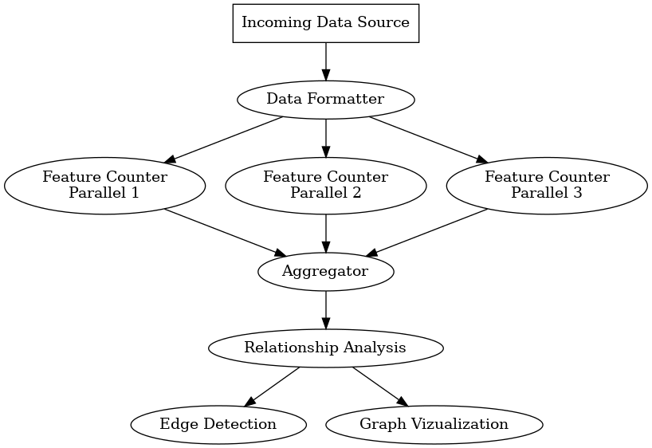

# Overview

The GAWSEED processing system allows easy statistical analysis of
time-series data via simple YAML configuration files.  This
architecture:

+ Collect information from data sources
+ Transform it to a standardized tab-separated format (called [FSDB])
+ Temporally bin, count and tabulate features within the dataset, producing a triple indexed output
+ Manipulate individual results using aggregation functions
+ Use extensible mathematical functions to combine multi-column datasets into final temporal waveform that are suitable for feature detection
+ Perform simple, distributed edge-detection to identify signals of interest.

# Architecture

## Incoming Data Source and Filter

## Data Formatter

## Feature Counter

The *Feature Counter* component is responsible for converting all
timeseries records into ``time bins'' and simultaneously counting or
quantifying the data.  The output records will consist of named
*index* keywords extracted from the YAML configuration, and a
*key* and *subkey* value that is extracted from the data
itself (if the second subkey column is not needed, an empty string is
typically used).

Example feature counter yaml config:

	binSize: 5
	timeColumn: time
	featureCounter:
	  outputs:
	    http_host_names:
	      function: gawseed.algorithm.generic.re_match_one
	      arguments: ['col(dnsname)', '.*https?://(^[/]+)/.*']
	    http_type:
	      function: gawseed.algorithm.generic.re_match_one
	      arguments: ['col(dnsname)', '(https:|http:)']

## Aggregator

The aggregator component of the GAWSEED architecture is responsible
for performing any calculations that require a complete dataset for a
given combination of the set *<timebin, index, key>*.  Summing
values from distributed operations and counting of unique subkeys are
the most common computations that occur at this step.

An example YAML configuration for this step in the data architecture
is shown in below.  This outputs both the total counts of the things
counted in the featureCounter step(s), and counts the number of unique
*http_host_names* values seen as well.

Example YAML configuration for the aggregator:

	aggregator:
	  aggregators:
	    - function: summer
	    - function: unique
	      arguments: ['http_host_names', 'unique_http_host_names']

## Relationship Analyzer

The Relationship Analyzer is where any heavy final math is performed.
For example, in the example data in this document, we may want to
calculate the ``popularity'' of each discovered *http_host_names*.
The YAML configuration to do this is shown below:

	relationshipAnalysis:
	  outputs:
	    host_name_popularity_fraction:
	      function: fraction_otherindex_keyval
	      arguments:
	        - unique_http_host_names
	        - http_host_names

Note that the Relationship Analyzer also pivots
the table back to a more normal looking table (at least for humans),
as the distributed processing aspects of the calculations are now
over; specifically, the previous index values are converted back into
table columns.

## Edge Detection and Result Analysis

TBD

# Copyright

